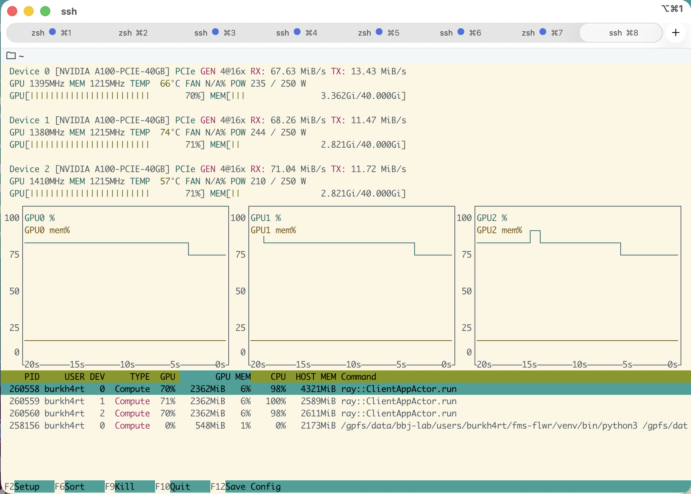
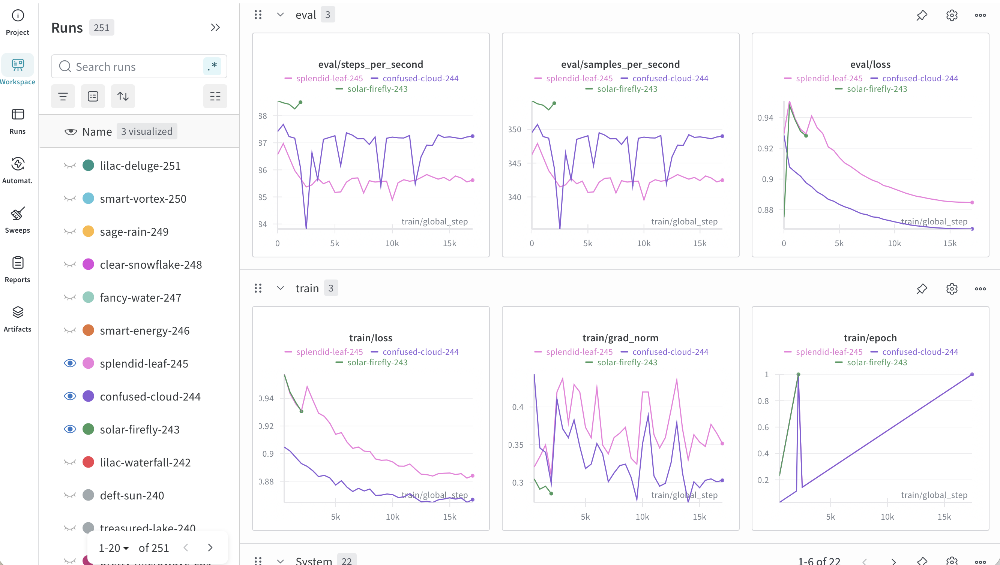

# fms-ehrs-flwr

This [flower](https://flower.ai) app performs federated training of a FM on
tokenized EHR data.

## Install

```bash
git clone https://github.com/bbj-lab/fms-ehrs-flwr
cd fms-ehrs-flwr
mkdir -p logs
# pip install uv
uv venv --python=$(which python3) venv
source venv/bin/activate
uv pip install --torch-backend=cu128 --link-mode=copy -e .
```

## Interactive run

You can develop code on a single gpu and use the `gpudev` partition which
generally has good availability. (This is not efficient, so I would use this
primarily for troubleshooting/debugging.)

```bash
systemd-run --scope --user tmux new -s gpuq
srun -p gpudev \
  --gres=gpu:1 \
  --cpus-per-task=3 \
  --time=1:00:00 \
  --job-name=adhoc \
  --pty bash -i

source venv/bin/activate
now() { TZ=America/Chicago date +%Y-%m-%dT%H%M%S%z ; }
flwr run . | tee logs/run-$(now).log
```

## Slurm

There's a second configuration that runs 3 gpu's on the `gpuq` partition.

```bash
jid=$(sbatch --parsable slurm.sh)
```

## Configuration

The [pyproject.toml](./pyproject.toml) file provides some configurable options
for our app:

```sh
[tool.flwr.app.config]
    data-dir                    = "/gpfs/data/bbj-lab/users/burkh4rt/data-mimic" # where the data lives
    data-version                = "W++" # the version of the data we're using
    gradient-accumulation-steps = 2 # waiting to aggregate gradients is a multiplier on the effective batch size
    local-epochs                = 1 # how long to let individual workers run before aggregating
    lr                          = 2e-4 # learning rate
    max-seq-length              = 1024
    model-dir                   = "/gpfs/data/bbj-lab/users/burkh4rt/mdls" # where to store trained models
    num-server-rounds           = 10 # number of epochs to run
    per-device-eval-batch-size  = 4
    per-device-train-batch-size = 4
    setup-version               = "1e_4b_10r_0002lr"
```

## Outputs

Logs from the runs are placed into the `logs` directory. Each one should record
all configuration settings used for the run,

```
[2025-10-15T16:44:13-0500] context.run_config={
    'data-dir': '/gpfs/data/bbj-lab/users/burkh4rt/data-mimic',
    'data-version': 'W++',
    'gradient-accumulation-steps': 2,
    'local-epochs': 1,
    'lr': 0.0002,
    'max-seq-length': 1024,
    'model-dir': '/gpfs/data/bbj-lab/users/burkh4rt/mdls',
    'num-server-rounds': 3,
    'per-device-eval-batch-size': 4,
    'per-device-train-batch-size': 4,
    'setup-version': '1e_4b_3r_0002lr'
    }
```

and a summary of performance on the evaluation set after each round:

```
[SUMMARY]
Run finished 3 round(s) in 9800.81s
History (loss, distributed):
    round 1: 0.931810670185353
    round 2: 0.8875063137023168
    round 3: 0.881442553112436
```

We've slightly modified flwr's implementation of
[FedAvg](https://arxiv.org/abs/1602.05629) to save a copy of the aggregated model
after each training round. Currently, these are saved to the `model-dir` entry in
our configuration.

## Monitoring

-   Running [nvtop](https://github.com/Syllo/nvtop) on the node running the job
    (`srun --jobid=$jid --pty nvtop`) should give you something like this:

    

-   Other statistics and real-time output is available on
    [weights and biases](wandb.ai) and should look something like this:

    

<!--

Format:
```
ruff format .
shfmt -w .
prettier --write *.md
```

-->
